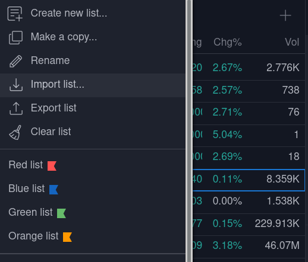
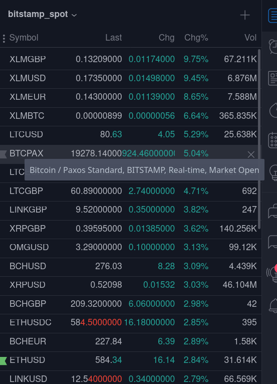

# TradingView Watchlist Generator

> so you never miss a new listing

## Why

I created this script to generate Binance Futures watchlists for myself. I wanted to know every symbol/pair that existed. Well, that was nice, but within a week, there were already new symbols supported by my exchange that I didn't have on my watchlist.

## How to use this project

1. You can [save watchlists!](generated/exchange_embedded_symbols/binance_spot.txt) directly from this project to your local hard drive. I plan to use the CICD tools on this platform to generate the watchlists daily
2. You can clone this repository and generate watchlists locallly for exchanges as you wish.

## Importing into Binance

1. Click on the name of the current watchlist to reveal the menu
2. Choose `Import list...`

## Exchange Embedded

Watchlists are generated in the `generated` folder. These come in 2 varieties.

1. [Generic Symbols!](generated/generic_symbols) - Just an ordinary watchlist 
2. [Symbols for quotes on a Specific Exchange!](generated/exchange_embedded_symbols) - Bid/Ask/Volume specific to an Exchange

## Caveats
- Chances are you want to be using Trading View's Crypto Screener tools in the first place...
- Chances are someone has already done this, but better. I didn't look to see.
- There may be bugs. If so, please raise an issue, and/or submit a pull request.
- I only use and test Binance Spot and Binance Futures.
- This likely generates watchlists for which TradingView doesn't directly Support. For example, if you wanted to see a quote for `BTC/USDT` specifically for binance, that watchlist entry would look like `BINANCE:BTCUSDT`. This works because TradingView gets feeds from Binance and knows exactly what the volume and price data is for that specific pairing.
- look in the `generated/generic` folder for a watchlist that contains the symbols supported by your exchange, but may not link directly to your specific exchange data - in most cases, I think just knowing the symbol paris should be sufficient. If not, well, why are you using TV then?
- This software is shipped with no guarentee, I will not be responsible if you miss any newly listed coins or make dumb trading

# Thank you!

Thanks for visiting this project, you can support this development in one of 2 ways:
1. [Sign-up for a TradingView Account Here!](https://www.tradingview.com/gopro/?share_your_love=b6d1016fdeb149be865b678a8ac935)
2. Send a Tip
    - ETH 0xF4eE6Ac4245AB693e427507A1b8fAf5022fd4021
    - BTC
    - LTC 